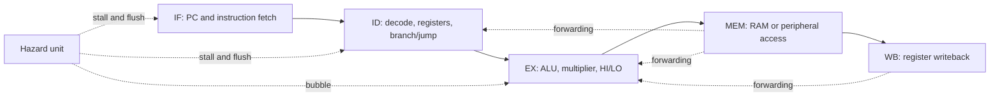

# MIPS CPU Architecture

Verilog implementations of a **single-cycle MIPS CPU**, a **five-stage pipelined MIPS CPU**, and a **system-on-chip with a factorial accelerator and GPIO**.

**Author: Simul Barua.** This repository brings together the RTL, assembly programs, architecture documentation and verification results. Provided starter RTL is identified separately. Original snapshots are retained alongside maintained versions with documented correctness fixes and portable verification.

## Designs

| Version | Implementation | Main features |
|---|---|---|
| [Single-cycle](designs/single-cycle) | Datapath and two-level control decoder | Arithmetic, memory, branches, shifts, `jal`/`jr`, 64-bit multiplication and HI/LO |
| [Pipeline](designs/pipeline) | IF → ID → EX → MEM → WB | Pipeline registers, operand forwarding, load-use stalls, early branch decisions, control flushing |
| [SoC](designs/soc) | Pipelined CPU with memory-mapped peripherals | Factorial accelerator, GPIO, status polling and input error handling |
| [Original snapshots](original) | Unmodified recovered source files | Baseline, enhanced single-cycle, standalone pipeline and SoC snapshots |

The maintained pipeline is based on the later CPU implementation saved with the SoC, which most closely matches the final report's `resultM`/`resultW` architecture. The earlier standalone pipeline remains in `original/pipeline`.

## Run the tests

Install Python 3 and Icarus Verilog (`iverilog` and `vvp`). On macOS, `brew install icarus-verilog`; on Ubuntu, `sudo apt-get install iverilog`.

```sh
python3 scripts/test.py all
python3 scripts/test.py single-cycle
python3 scripts/test.py pipeline
python3 scripts/test.py soc
```

The runner compiles each design independently, generates its ROM image, runs bounded self-checking simulations, and saves logs under `build/`. It checks **60 cases**:

- Each CPU: factorial inputs 0–12, plus nine focused instruction/hazard programs.
- SoC: inputs 0–15, including error outputs for inputs 13–15.

All 60 cases passed locally with Icarus Verilog. GitHub Actions runs the same command. See [verification](docs/verification.md) for scope and remaining limitations.

Do not compile every Verilog file in this repository together: the independent versions intentionally reuse module names.

## Architecture



Supported CPU instructions: `add`, `sub`, `and`, `or`, `slt`, `addi`, `lw`, `sw`, `beq`, `j`, `jal`, `jr`, `sll`, `srl`, `multu`, `mfhi`, `mflo`. This is an educational MIPS subset with `PC+4` link addresses and no architectural delay slots. It does not implement the complete MIPS ISA or exception behavior.

## What the reports show

The assignments progress from factorial hardware and MIPS assembly to processor verification, enhanced single-cycle RTL, pipeline hazard handling and peripheral integration. The report's factorial benchmark at n=4 records **57 single-cycle cycles**, **74 pipeline cycles**, and **33 SoC cycles**. The maintained harness reproduces 74 and 33; it reports 58 for single-cycle because it observes completion one cycle later.

Cycle count alone does not establish elapsed-time speedup: the reports do not supply a measured clock-frequency or timing-closure comparison.

- [Assignment analysis and source evidence](docs/assignment-analysis.md)
- [Datapath, hazards and memory map](docs/architecture.md)
- [Changes made during restoration](docs/restoration.md)
- [Verification and limitations](docs/verification.md)
- [Report benchmark data](docs/report-cycle-counts.csv)
- [Source manifest with SHA-256 hashes](docs/source-manifest.json)

Original reports, student identifiers, administrative documents and tool-generated project caches are omitted. No open-source license is asserted for provided starter material.
