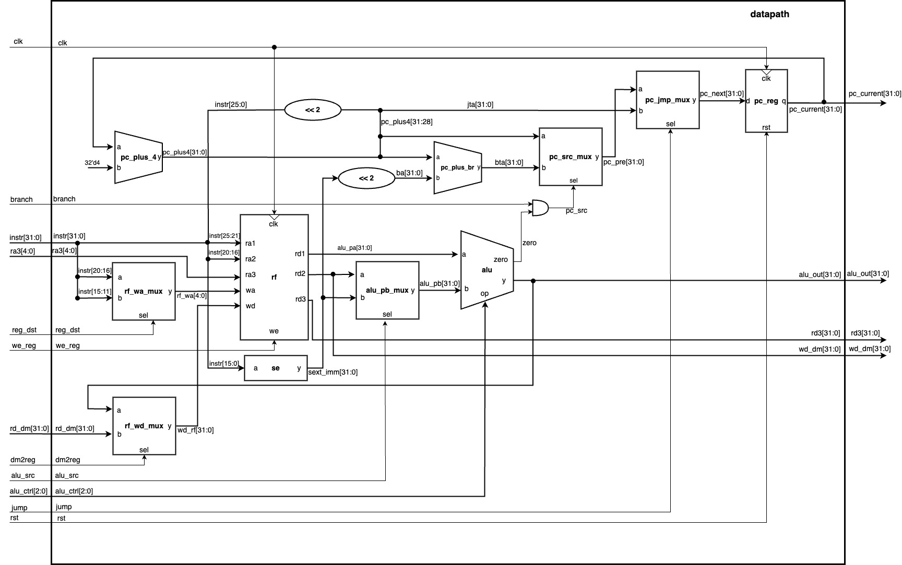
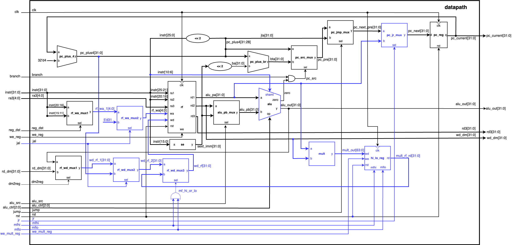
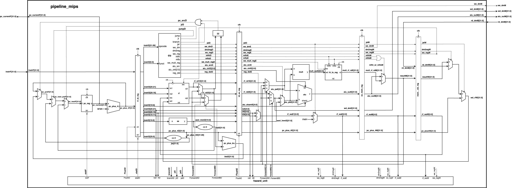
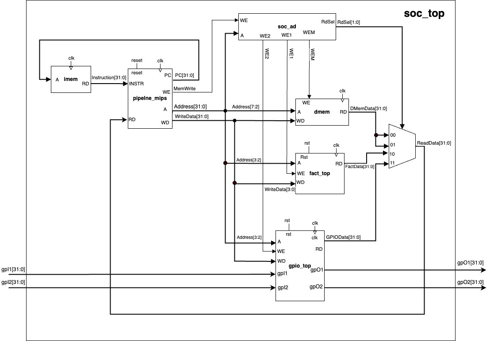

# 32-bit MIPS CPU

A Verilog processor project with a single-cycle CPU, a five-stage pipelined CPU, and a system-on-chip (SoC) that integrates a factorial accelerator and GPIO. The designs explore instruction execution, pipeline hazards, recursive software and memory-mapped hardware acceleration.

**Author: Simul Barua**

## C++ implementation

The companion [CPU_Design repository](https://github.com/purav-sjsu/CPU_Design) contains the C++ implementation of a 32-bit single-cycle MIPS CPU, along with an assembler, emulator, and example programs for recursive factorial and Fibonacci. It provides a software implementation of the processor architecture explored here in Verilog.

## Design features

- **32-bit datapath** with 32 general-purpose registers and a debug register-read port.
- **Single-cycle CPU** with separate datapath and control modules, opcode/function decoding, and selectable ALU, memory and link-address writeback.
- **Five-stage pipeline:** Instruction Fetch (IF), Instruction Decode (ID), Execute (EX), Memory Access (MEM) and Writeback (WB), separated by pipeline registers.
- **Hazard handling** with MEM/WB operand forwarding, load-use stalls, early branch comparison in ID, register-jump dependencies and control-transfer flushing.
- **Unsigned multiplication** producing a 64-bit result held in the 32-bit HI and LO registers.
- **Separate instruction and data memories**, each containing 64 × 32-bit words in the supplied wrappers.
- **Memory-mapped factorial accelerator and GPIO**, with software-controlled operand submission, completion polling and result output.

The single-cycle extensions add multiplication, HI/LO reads, logical shifts and function-call support to the basic arithmetic, load/store and branch datapath. The pipelined design carries the corresponding operands and control signals through the stages while resolving dependencies between instructions.

## Supported instructions

| Category | Instructions |
|---|---|
| Arithmetic and logic | `add`, `sub`, `and`, `or`, `slt`, `addi` |
| Memory | `lw`, `sw` |
| Control flow | `beq`, `j`, `jal`, `jr` |
| Logical shifts | `sll`, `srl` |
| Multiply and HI/LO | `multu`, `mfhi`, `mflo` |

This implementation supports a MIPS instruction subset. It uses `PC+4` as the `jal` return address and does not implement architectural delay slots, exceptions, interrupts or byte/halfword accesses. The maintained ALU uses signed comparison for `slt`.

## Architecture drawings

These are the original project drawings. Click an image to view it at full resolution. The [diagram gallery](docs/diagrams/README.md) includes supporting block diagrams and editable Draw.io files.

### Baseline single-cycle datapath

[](docs/diagrams/baseline/datapath.jpg)

### Enhanced single-cycle datapath

The blue paths show the added multiplier, HI/LO registers, shift input and jump/link connections.

[](docs/diagrams/single-cycle/datapath.png)

### Five-stage pipelined CPU

[](docs/diagrams/pipeline/pipeline.jpg)

### System-on-chip

[](docs/diagrams/soc/soc_top.jpg)

The drawings reflect the original design snapshots. Changes to the maintained RTL are documented in the [restoration notes](docs/restoration.md).

## Factorial workload and SoC

The CPU workload computes factorial recursively. It exercises stack allocation, saved arguments and return addresses, `jal`/`jr`, multiplication and LO writeback. The single-cycle test program also includes left and right shifts.

The SoC computes factorial through a hardware accelerator. Software reads the GPIO input, writes the operand and Go control, polls the status register, then writes the status and result to GPIO outputs. The accelerator accepts a four-bit operand: inputs 0–12 have valid 32-bit results, while inputs 13–15 produce an error.

| Block | Byte-address range | Interface |
|---|---|---|
| Data RAM | `0x000–0x0FC` | 64 word locations |
| Factorial accelerator | `0x800–0x80C` | Operand, Go, status and result |
| GPIO | `0x900–0x90C` | Two input and two output registers |

See [architecture details](docs/architecture.md) for the register map and forwarding paths.

## Run verification

The original designs were simulated in Vivado Design Suite 2024.2. The repository provides portable self-checking tests using **Python 3** and **Icarus Verilog** (`iverilog` and `vvp`), with no additional Python packages.

Install Icarus Verilog with `brew install icarus-verilog` on macOS or `sudo apt-get install iverilog` on Ubuntu, then run:

```sh
python3 scripts/test.py all
```

To test one design:

```sh
python3 scripts/test.py single-cycle
python3 scripts/test.py pipeline
python3 scripts/test.py soc
```

**All 60 checks passed locally and in GitHub Actions:**

| Target | Checks |
|---|---|
| Single-cycle CPU | Factorial inputs 0–12 and nine focused instruction tests |
| Pipelined CPU | Factorial inputs 0–12 and nine focused instruction/hazard tests |
| SoC | Inputs 0–15, including invalid-input status and output checks |

Focused tests cover forwarding priority, full-width branch comparison, taken-branch flushing, load-use dependencies, `jr` after a load, `jal` link forwarding, nonzero HI results, signed `slt` and shift-amount changes. The runner checks outputs against independent expected values and enforces simulation timeouts. Logs and generated ROM images are written to `build/`.

Compile each version independently because the designs reuse module names. These are directed functional simulations; they do not establish exhaustive ISA coverage or FPGA timing closure. See [verification details](docs/verification.md).

## Cycle-count comparison

For the same input, `factorial(4) = 24`:

| Implementation | Original report | Current test harness |
|---|---:|---:|
| Single-cycle CPU | 57 cycles | 58 cycles |
| Pipelined CPU | 74 cycles | 74 cycles |
| SoC with accelerator | 33 cycles | 33 cycles |

The single-cycle harness observes completion one cycle later than the original measurement. The recursive program incurs pipeline stalls and flushes, while the SoC offloads the factorial computation to hardware. Elapsed-time speedup cannot be inferred from cycle counts alone without measured clock periods.

The [full reported benchmark](docs/report-cycle-counts.csv) covers inputs 0–12; [current simulation results](docs/validated-results.json) are recorded separately.

## Repository layout

| Directory | Contents |
|---|---|
| `designs/single-cycle/` | Maintained enhanced single-cycle CPU and testbench |
| `designs/pipeline/` | Maintained five-stage CPU and testbench |
| `designs/soc/` | Maintained SoC, accelerator, GPIO and testbench |
| `original/` | Unmodified baseline and implementation snapshots |
| `programs/` | Supporting MIPS assembly exercises |
| `scripts/` | Simulation and reference-result checks |
| `docs/` | Architecture, drawings, verification and development analysis |

The maintained pipeline uses the final CPU implementation saved with the SoC. The earlier standalone pipeline is preserved in `original/pipeline`. Provided starter RTL is identified in the [development analysis](docs/assignment-analysis.md); the [source manifest](docs/source-manifest.json) records original paths and SHA-256 hashes. No open-source license is asserted for provided starter material.
