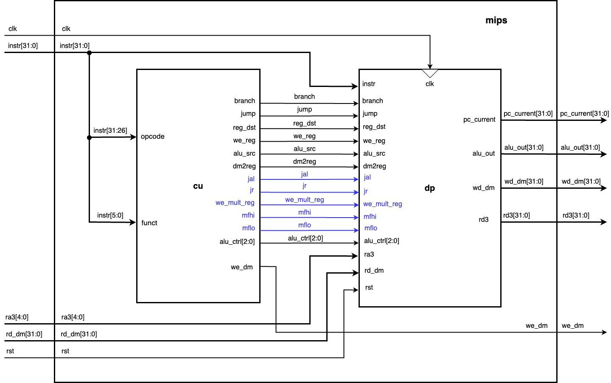
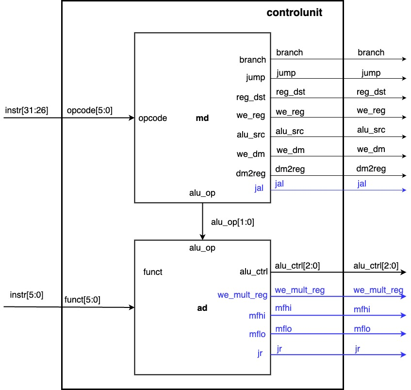
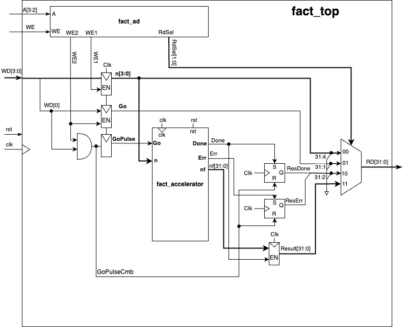
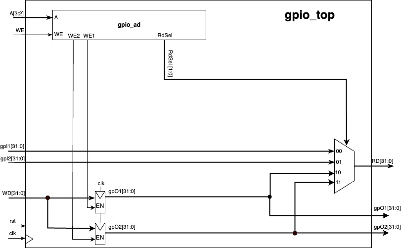

# Original architecture drawings

These images and Draw.io documents are copied directly from the saved project assets. The baseline, enhanced single-cycle, pipeline and SoC versions are kept separately. Original file hashes and source paths are recorded in the [source manifest](../source-manifest.json).

The drawings reflect the original design snapshots. See the [restoration notes](../restoration.md) for subsequent changes to the maintained RTL.

## Baseline single-cycle

| Block | Image | Editable source |
|---|---|---|
| Datapath | [View](baseline/datapath.jpg) | [Draw.io](baseline/datapath.drawio) |
| Processor core | [View](baseline/mips.jpg) | [Draw.io](baseline/mips.drawio) |
| Processor with memories | [View](baseline/mips_top.jpg) | [Draw.io](baseline/mips_top.drawio) |
| Control unit | [View](baseline/CU.jpg) | [Draw.io](baseline/CU.drawio) |
| Instruction memory | [View](baseline/imem.jpg) | [Draw.io](baseline/imem.drawio) |
| Data memory | [View](baseline/dmem.jpg) | [Draw.io](baseline/dmem.drawio) |

## Enhanced single-cycle

Blue connections highlight the extensions to the baseline design.

Editable sources: [datapath](single-cycle/datapath.drawio), [processor core](single-cycle/mips.drawio), [control unit](single-cycle/CU.drawio).

## Five-stage pipeline

Editable sources: [pipeline drawing](pipeline/pipeline.drawio), [alternate saved pipeline drawing](pipeline/pipeline-alternate.drawio).

The alternate file was saved as `pipeline_mips 2.drawio`. It is retained as an additional drawing version; its filename alone does not establish that it is newer or the source of the JPEG export.

## SoC and peripheral blocks

Separate editable sources for these three peripheral/integration exports were not found in the inspected assets folder.
